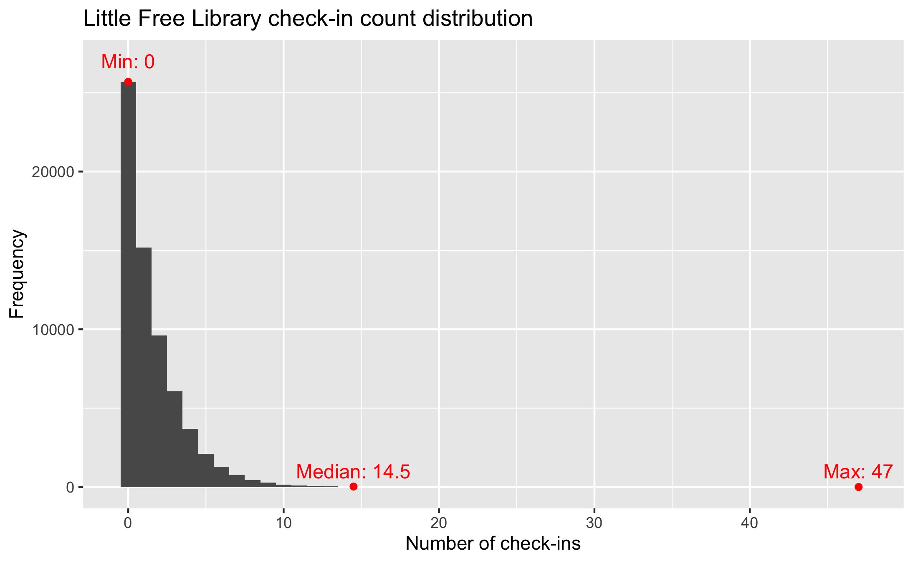
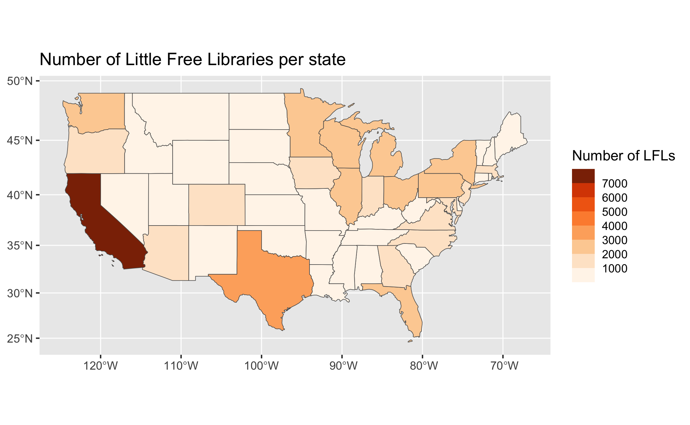
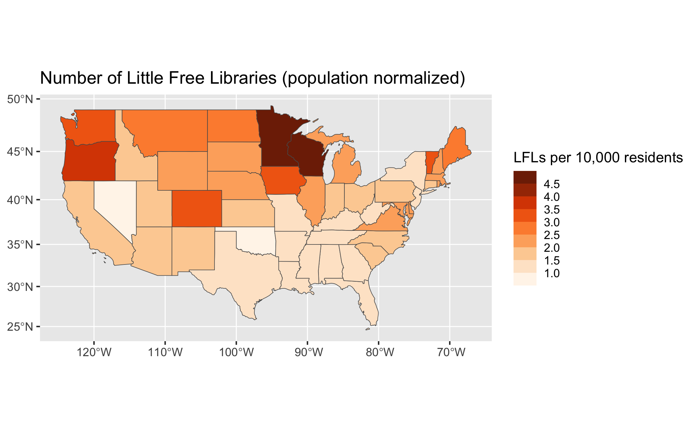

# Little_Free_Data
Data analysis of Little Free Libraries

Data was scraped from the Little Free Library website on April 17, 2023.

## Prerequisites
Look at analysis.Rmd for main code. Download the GADM data as a Geopackage from [here](https://gadm.org/data.html). Make sure to place it in the project directory in order to reproduce my results in R.

Required R libraries:

```r
tidyverse
readr
sf
spData
tidycensus
```

You will also need a Census API key which you can get from [here](https://api.census.gov/data/key_signup.html). I've already retrieved population data by state and stored it in census_pop_data.csv.
## Selected graphs






