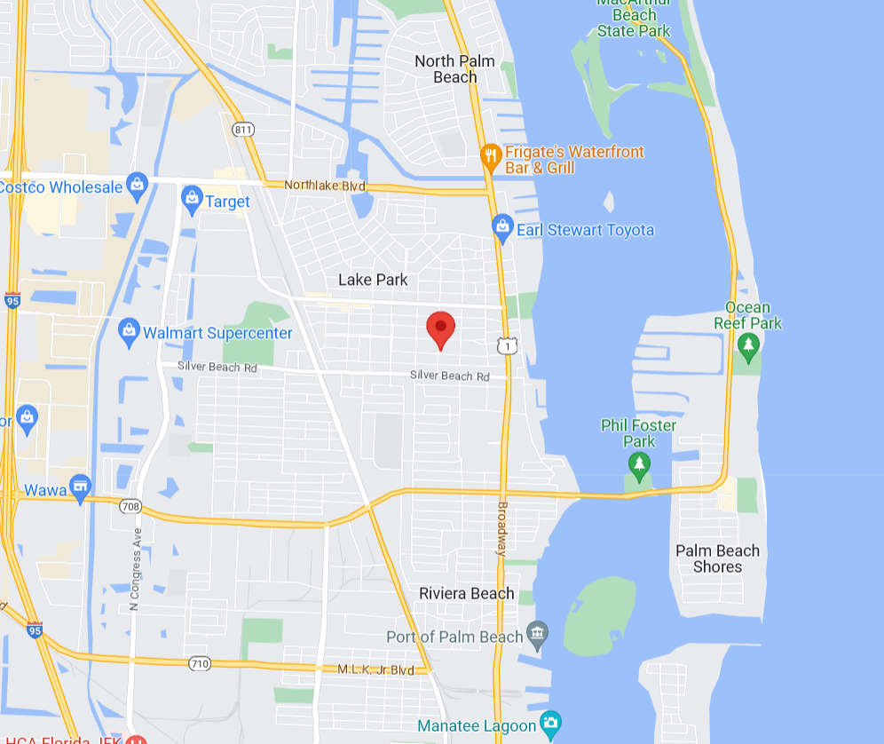
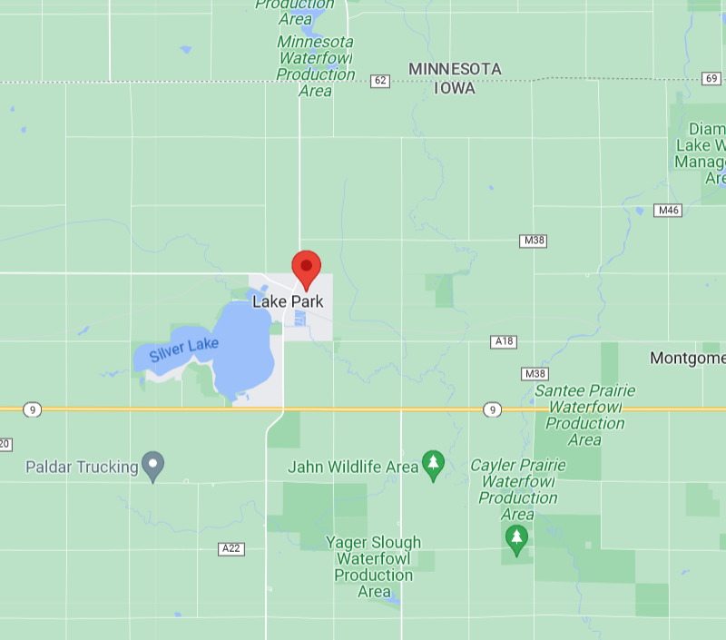
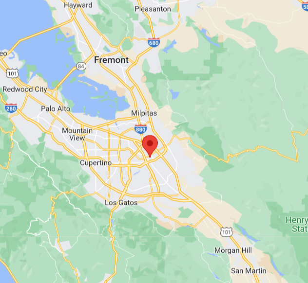
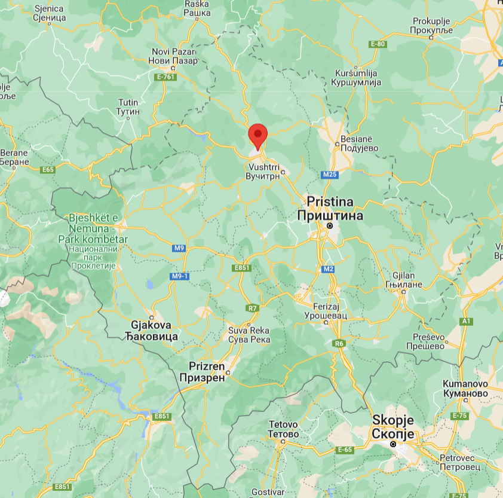
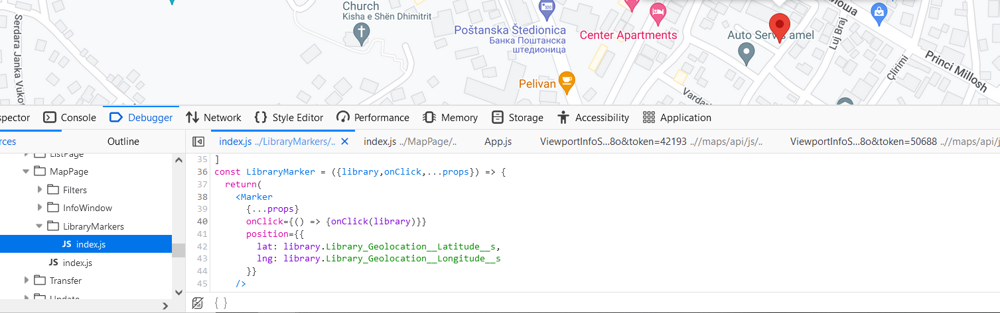

```{r setup}
library(tidyverse)
library(readr)
library(sf)
library(spData)

rm(list = ls())
```

```{r}
typeof(read_csv("libraries.csv"))
if (file.exists("lfl.RData")) {
  load("lfl.RData")
} else {
  libraries = as_tibble(read_csv("libraries.csv"))
  save(libraries, file = "lfl.RData")
}
```

## Data Cleaning and Preparation

```{r}
lapply(libraries, typeof)
```

Map_Me__c needs to be transformed into a logical variable, as "Taken Down Temporarily" and "Mapped" are the only two categories.

```{r}
libraries <- libraries %>% mutate(Map_Me__c = Map_Me__c ==  "Mapped")
```


```{r}
max(libraries$check_in_count)
```

```{r}
check_in_dist <- libraries  %>% count(check_in_count)
ggplot(data = libraries, aes(x =  check_in_count)) +
  ggtitle("Check-in count distribution") +
  xlab("Number of check-ins") +
  geom_histogram(binwidth = 1)
```


```{r}
# Clean up alternative names for the same country:
libraries <- libraries %>% mutate(Country__c = replace(Country__c, Country__c %in% c("USA", "US", "U.S.", "us", "Us"), "United States"))  %>% mutate(Country__c = replace(Country__c, Country__c == "canada", "Canada"))

# Ranking of countries by number of little free libraries:
libraries %>% count(Country__c) %>% arrange(desc(n))
```

The U.S. by and large has the greatest amount of little free libraries (with alternate spellings outpacing many countries even). Canada is the only country with a somewhat comparable amount, specifically if you adjust for population size.


```{r}
# US population
us_pop <- 331900000

# Canada population
can_pop <- 38250000

us_count <- libraries %>% filter(Country__c == "United States") %>% nrow

can_count <- libraries %>% filter(Country__c == "Canada") %>% nrow
```

So the per capita number of little free libraries in the US is:
```{r}
format(us_count/us_pop, scientific = FALSE)
```
And in Canada is:
```{r}
format(can_count/can_pop, scientific = FALSE)
```

So we can conclude that Little Free Libraries are a predominately American phenomenon. For the purposes of further analysis, let's exclude all data points not in the US:

```{r}
libraries <- libraries %>% filter(Country__c == "United States")
```

How about the distribution by state?

```{r}
length(unique(libraries$State_Province_Region__c))
```
But there's only 50 states!
```{r}
libraries %>% count(State_Province_Region__c) %>% arrange(desc(n))
```

There's a bunch of different spelling variations. Let's instead take the actual coordinates and then find the states ourselves. One point of interest in the dataset to note that there are two sets of coordinates for each row: Latitude_MapAnything__c and Longitude_MapAnything__c vs Library_Geolocation__Latitude__s and Library_Geolocation__Longitude__s.

We can make a datframe with the differences as separate columns:

```{r}
differences <- libraries %>% mutate(dif_lat = (abs(Latitude_MapAnything__c) - abs(Library_Geolocation__Latitude__s)), dif_long = abs(Longitude_MapAnything__c) - abs(Library_Geolocation__Longitude__s)) %>% select(dif_lat, dif_long, Latitude_MapAnything__c, Library_Geolocation__Latitude__s, Longitude_MapAnything__c, Library_Geolocation__Longitude__s)
```

If we take one example with a latitude difference of 16.6 and the plug the coordinates into Google maps, we get two different locations, one in Lake Park Iowa and the other in Lake Park Florida:
```{r}
libraries %>% filter(Latitude_MapAnything__c == 26.79489)
```
The MapAnything location:


The geolocation:



Another example is a location with a 101 degree difference in longitude. 

```{r}
libraries %>% filter(Latitude_MapAnything__c == 37.33889)
```
The actual location is in Kosovo, but because they put "KS" as the state this row was mistakenly assigned "United States" as its country. 

The MapAnything location is in San Jose:


and the Geolocation is in Kosovo:


So we have two different examples where the correct coordinates are of different types. 


```{r}
libraries %>% select(Latitude_MapAnything__c, Library_Geolocation__Latitude__s, Longitude_MapAnything__c, Library_Geolocation__Longitude__s) %>% summary()
```
Thus summary statistics are similar, but there are enough differences to cause concern. Note that there are a decent amount of rows where the MapAnything coordinates are (0, 0):

```{r}
libraries %>% filter(Latitude_MapAnything__c == 0 & Longitude_MapAnything__c == 0) %>% count()
```
```{r}
libraries %>% filter(id == 14180)
```


These are basically missing values as all the libraries we are looking at are in the US and thus can't have these coordinates. If we look at the webapp, it appears that the developers use the geolocation values on the interactive map:



So let's just go with that then. 


```{r}
libraries %>% select(Postal_Zip_Code__c) %>% unique %>% count
```


```{r}
lonlat_to_state <- function(pointsDF,
                            states = spData::us_states,
                            name_col = "NAME") {
    ## Convert points data.frame to an sf POINTS object
    pts <- st_as_sf(pointsDF, coords = 1:2, crs = 4326)

    ## Transform spatial data to some planar coordinate system
    ## (e.g. Web Mercator) as required for geometric operations
    states <- st_transform(states, crs = 3857)
    pts <- st_transform(pts, crs = 3857)

    ## Find names of state (if any) intersected by each point
    state_names <- states[[name_col]]
    ii <- as.integer(st_intersects(pts, states))
    print(ii[49])
    state_names[ii]
}

## Test the function with points in Wisconsin, Oregon, and France
testPoints <- data.frame(x = c(-90, -120, 0), y = c(44, 44, 44))
test <- data.frame(libraries %>% select(Library_Geolocation__Longitude__s, Library_Geolocation__Latitude__s) %>% lonlat_to_state, libraries$State_Province_Region__c)
sum(is.na(test$libraries.....select.Library_Geolocation__Longitude__s..Library_Geolocation__Latitude__s......))
```
```{r}
libraries[50,]
```

Research Q's:

Is their a correlation between income in a given zip code and the number of little free libraries?
What about political part preference?
How about climate(i.e. colder areas might have less LFLs which are outdoors by design)


